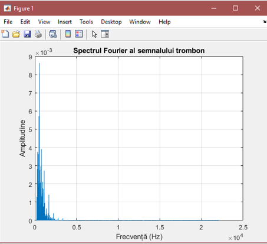
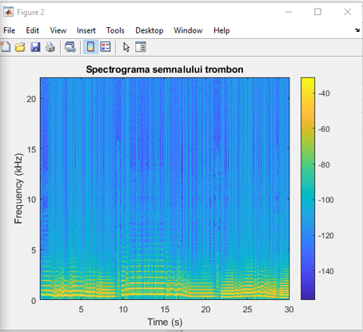
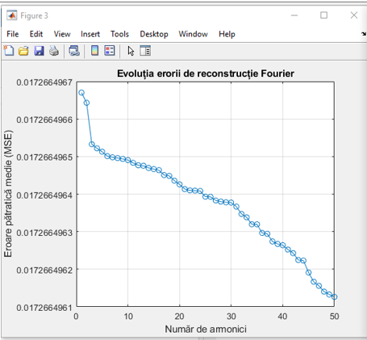

# 🎧 Fourier Analysis of Trombone Audio Signal

This MATLAB project performs a spectral analysis of a real audio signal (`trombon.wav`) using the Fast Fourier Transform (FFT). The program extracts frequency components, generates a spectrogram, reconstructs the signal using a limited number of harmonics, and evaluates the reconstruction accuracy using Mean Squared Error (MSE).

---

## ⚙️ Technologies

- MATLAB R2020a+  
- Fast Fourier Transform (FFT)  
- Signal processing  
- Time-frequency visualization (Spectrogram)  
- MSE analysis

---

## 📈 Features

- Loads audio file and converts stereo to mono if needed
- Applies FFT to extract frequency components
- Displays amplitude spectrum (up to 100 kHz)
- Generates spectrogram to show frequency variation over time
- Reconstructs the signal using 1–50 harmonics
- Plots MSE to evaluate reconstruction accuracy

---

### Amplitude Spectrum
<p align="center">
  
</p>

### Spectrogram
<p align="center">
  
</p>

### MSE Plot
<p align="center">
  
</p>

---

##▶️ How to Run

- Open MATLAB
- Make sure trombon.wav is in the same folder as the script
- Run the script: analiza_fourier

---

## 📁 Project Structure

```text
📂 root/
│
├── analiza_fourier.m         # Main MATLAB script
├── trombon.wav               # Audio signal file (not included in public repo)
├── docs/
│   ├── spectrum.png          # Screenshot of amplitude spectrum
│   ├── spectrogram.png       # Screenshot of spectrogram
│   └── mse_graph.png         # Screenshot of MSE plot
└── README.md                 # Project documentation
